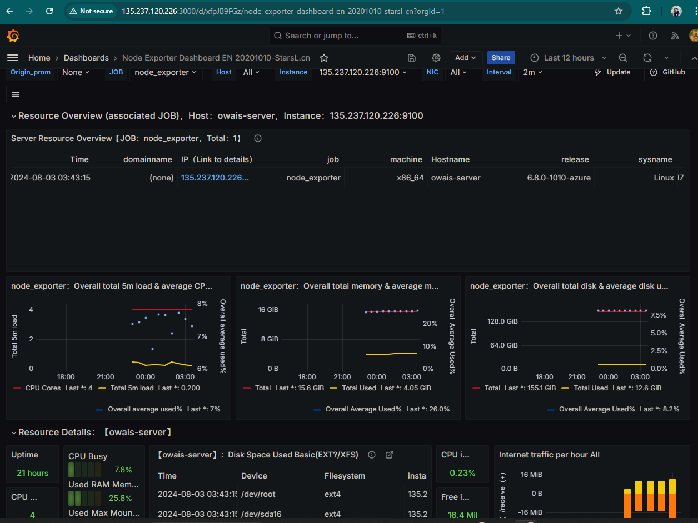

# Owais Assessment

## Introduction

This project involves setting up a cloud-based application infrastructure with various components including Docker, Kubernetes, Terraform, Ansible, Jenkins, and monitoring tools. Below are the steps and configurations used for this setup.

## Application Configuration

To make application variables dynamic and manageable, we use environment variables stored in a `.env` file. The following files were updated to support this:
- `mongo.js`
- `redis.js`
- `sequelize.js`
- `index.js`
- `config.js`

## Local Testing

To test the application locally, use Docker Compose. Navigate to the `nodejs-api-template` directory and run:

```bash
cd nodejs-api-template
sudo docker-compose up -d


------
The Steps : 

Infrastructure Provisioning
Provision Infrastructure on AWS:

Components: VPC, EC2, RDS Database, Security Groups, and IAM roles.
Diagram:


------

Setup Instructions:

Install Terraform and update variables in ./Terraform/terraform.tfvars according to your environment.

Run the following commands after setting your AWS credentials in ~/.aws/credentials:

# cd Terraform 
# terraform init
# terraform plan --var-file terraform.tfvars
# terraform apply --var-file --auto-approve 

The infrastructure state is stored in an S3 bucket, with a lock file in DynamoDB.

--------------------------------------------

Configure Servers with Ansible:

Components: Configure Ubuntu servers with Nginx, Let’s Encrypt, and firewall rules.
Files: Update variables in ansible.cfg, inventory.ini, playbook.yml, and role variables.
Commands:

Check syntax: ansible-playbook playbook.yml --syntax-check
Ping the server: ansible all -i inventory.ini -m ping
Run the playbook: ansible-playbook -i inventory.ini playbook.yml
Docker and Kubernetes
Docker: Built and pushed the API image to Docker Hub:

Image Name: mohamedabdelaziz10/owais-backend:v1
Kubernetes:

The manifests for deployment are located in the k8s/ directory.
Deployed on Minikube with Horizontal Pod Autoscaler and Network Policies.

 -------------
Cloud Environment
Due to the closure of my Amazon account during project implementation, the environment was replicated on Microsoft Azure. The current setup is for development purposes only and does not include a production domain.
 ---------------------------------------------

Jenkins Setup
 Jenkins Configuration: Available at http://135.237.120.226:8080
 Jenkinsfile: Located at ./Jenkinsfile

 ------------------------

AApplication Access
After running the pipeline and applying the Kubernetes manifests, the application is accessible via NodePort at http://192.168.49.2:30003. Nginx is used as a reverse proxy listening on port 80:

App URL: http://135.237.120.226:80

Note: A domain certificate is not provided due to latency issues with free domains. A domain with a certificate will be used in production. 

-----------------------------------------

Monitoring and Logging
Tools: Prometheus, Grafana, NodeExporter, and Blackbox Exporter.

Docker Compose: Use Docker Compose to set up these tools and create dashboards for application status, Jenkins metrics, and server metrics.

Endpoints:

Prometheus: http://135.237.120.226:9090

Grafana: http://135.237.120.226:3000
Username: admin
Password: owais-grafana-pw


 -------

  Prometheus Targets : 

  


 This is the Three Dashboards : 
  
   1 - Application health check Dashboard (id: 7587)


   2 - Server Metrics Dashboard (id: 11074)




   3 - Jenkins Performance and Health (id: 9964)


--------------------------------

API Testing :


-----------------------------------------------------------------------------------------------------------------------------
-----------------------------------------------------------------------------------------------------------------------------

To improve or scale this setup in a production environment , consider the following:

1.Source Code Enhancement: 
 - Using Branches for Multiple Environments
   Objective: Improve management and deployment of code across different environments ( development, staging, production) by using Git branches to isolate and manage environment-specific changes.


2.Dockerization Enhancement: 
  Up-to-Date Images, Multi-Stage Builds, and Security Best Practices
  Objective: Improve the Dockerization process by leveraging up-to-date images, implementing multi-stage builds for efficiency, and security best practices to ensure secure and optimized containerized applications.


3. Terraform Enhancements

 - Terraform Modules
    Objective: Promote code reusability and maintainability by encapsulating infrastructure components into reusable modules.
 
 - Terraform Workspaces
   Objective: Manage multiple environments (e.g., development, staging, production) using isolated workspaces to maintain separate state files and configurations.


4. Kubernetes Enhancements
--------------------------

 - Switch to Managed Kubernetes Service: Replace Minikube with a managed Kubernetes service  Amazon EKS (Elastic Kubernetes Service). 
   This provides better scalability, security, and operational management.

 - High Availability:
   Deploy Kubernetes across multiple availability zones to ensure high availability and fault tolerance.

 - Cluster Autoscaler
   Objective: Automatically adjust the number of nodes in your Kubernetes cluster based on current resource utilization, ensuring efficient use of resources and cost management.

 - Ingress Controller
   Objective: Manage and secure external access to your services, providing routing and load balancing capabilities.

 - Rancher
   Objective: Simplify the management of Kubernetes clusters with a user-friendly interface, providing tools for cluster management, monitoring, and security.
  
 - Prometheus and ELK Stack
   Objective: Implement comprehensive monitoring and logging solutions to observe system performance and diagnose issues.


Overall Security Practices: Private Subnet, Restricted Internet Access, and IAM Least Privilege
Objective: Enhance the security of  cloud infrastructure by ensuring all resources are confined to private subnets with no direct internet access and by enforcing least privilege access controls using IAM.